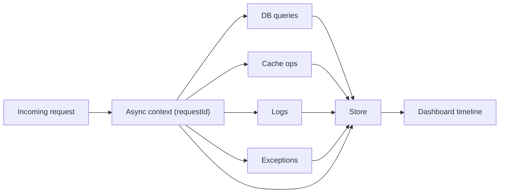

# Core Concepts

A quick mental model of how Lens works. Understand these five ideas and every other page in the
docs will click into place.

## 1. Everything correlates to a request

The central idea in Lens is **correlation**. When a request arrives, Lens assigns it a
`requestId` and opens an async context around its whole lifecycle. Any query, cache operation, log
line, outbound HTTP call, or exception that happens while that request runs is tagged with the same
`requestId` — so the dashboard can show you the complete story of a single request.

This is why the built-in integrations use helpers like `withLensPrisma` or `attachSequelizeLens`:
they capture the `requestId` **in-context** at query-issue time, because most drivers fire their
log callbacks from a detached context where that link is otherwise lost.

## 2. The layers

Lens is a set of clean layers. A thin **adapter** feeds a neutral **core** engine, which persists
to a pluggable **store** and serves the bundled **dashboard**.

<ArchitectureDiagram />

Dependencies only point toward the core: adapters and handlers translate your framework and ORM
into the core's neutral data shapes — they never re-implement capture, storage, or routing.

## 3. Watchers capture signals

A **watcher** is responsible for one kind of signal. The request and exception watchers are on by
default; the rest are opt-in.

- Framework watchers (requests, exceptions, cache, mail) live in your **adapter** and are toggled
  from `lens()` config.
- ORM and mailer integrations live in `@lensjs/watchers` and are wired via a **handler**.

See [Watchers](/watchers/) for the full list.

## 4. Stores persist what's captured

Everything flows through a single **Store** contract, so the dashboard and API never care what's
behind it. The default is an embedded SQLite file; switch to Postgres or MySQL with one line for
production or multi-instance deployments. Writes are **batched and non-blocking** — capture never
sits on your request's critical path. See [Storage Backends](/getting-started/stores).

## 5. It's private and non-blocking

Two promises shape every design decision:

<Callout type="security" title="Private by default">
Secrets and PII are redacted before storage, files and buffers are purged, and user identity is
attached only when your <code>isAuthenticated</code> callback allows it. Nothing leaves your
infrastructure.
</Callout>

<Callout type="performance" title="Invisible to your users">
Instrumentation is queued and never throws into your app. <a href="/getting-started/sampling-and-retention">Sampling
and retention</a> keep overhead and storage bounded on high-traffic services.
</Callout>

## Next steps

<CardGrid :cols="2">
  <Card icon="rocket" title="Quick Start" href="/getting-started/quick-start">
    Install an adapter and open your dashboard.
  </Card>
  <Card icon="settings" title="Configuration" href="/configuration">
    Every <code>lens()</code> option in one reference.
  </Card>
</CardGrid>
