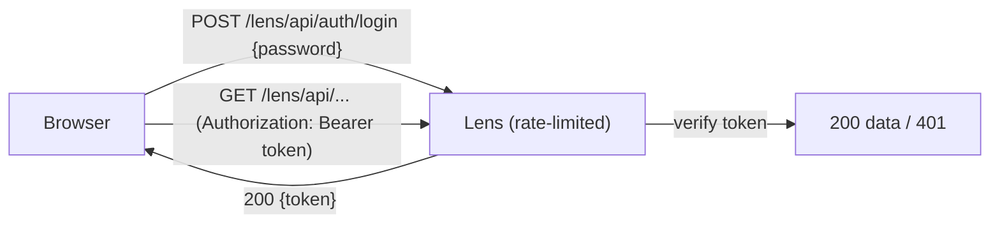

# Securing the Dashboard

The Lens dashboard exposes captured requests, queries, cache operations, mail, and exceptions. On any shared or non-local environment (staging, preview, production) you should lock it behind a password.

Setting `auth.password` in the adapter config turns on a built-in password lock: visitors get a login screen, and every Lens API route requires a valid token. When `auth` is not set, the dashboard stays open (unchanged behavior).

## How it works

- The login endpoint verifies the password and returns a short-lived, stateless **HMAC token**.
- The dashboard stores the token and sends it as `Authorization: Bearer <token>` on every request; the server verifies it on each API call.
- The token is signed with a key derived from your password, so changing the password invalidates existing sessions.



## Configuration

Provide the password from configuration/environment — never hard-code it.

### Express

```ts
import { lens } from "@lensjs/express";

await lens({
  app,
  auth: { password: process.env.LENS_PASSWORD! },
});
```

### Fastify

```ts
import { lens } from "@lensjs/fastify";

await lens({
  app,
  auth: { password: process.env.LENS_PASSWORD! },
});
```

### NestJS

```ts
import { lens } from "@lensjs/nestjs";

await lens({
  app,
  adapter: "fastify", // or "express"
  auth: { password: process.env.LENS_PASSWORD! },
});
```

### AdonisJS

```ts
// config/lens.ts
import { defineConfig } from "@lensjs/adonis";
import env from "#start/env";

export default defineConfig({
  // ...existing config
  auth: { password: env.get("LENS_PASSWORD") },
});
```

## Options

| Option        | Type     | Default   | Description                                                        |
| ------------- | -------- | --------- | ------------------------------------------------------------------ |
| `password`    | `string` | —         | Required to enable the lock.                                       |
| `secret`      | `string` | password  | Optional signing secret; by default the key is derived from the password. |
| `tokenTtl`    | `number` | `43200`   | Token lifetime in **seconds** (default 12h).                       |
| `maxAttempts` | `number` | `5`       | Failed attempts per window before lockout.                         |
| `windowMs`    | `number` | `60000`   | Rate-limit window in milliseconds.                                 |
| `lockoutMs`   | `number` | `60000`   | Base lockout in ms; doubles on each lockout, capped at 1h.         |

## Hardening details

- **Brute-force / DoS:** the login endpoint is rate-limited per client IP with an exponential lockout (`429 Too Many Requests` + `Retry-After`). Unauthenticated API requests are rejected by a cheap token check before any database access.
- **Timing / enumeration:** the password is compared in constant time, and all failures return an identical generic response — there is nothing to enumerate.
- **Tokens:** short-lived, HMAC-signed, tamper-evident, and tied to the password.

::: warning Use HTTPS
Tokens (and the password on login) travel in the request. Always serve the dashboard over HTTPS in production so they cannot be intercepted.
:::

::: tip Rate limiting is per-process
The rate limiter is in-memory, so limits are tracked per Node process. If you run multiple instances behind a load balancer, add a shared rate limit (e.g. at the proxy) for cluster-wide protection.
:::
