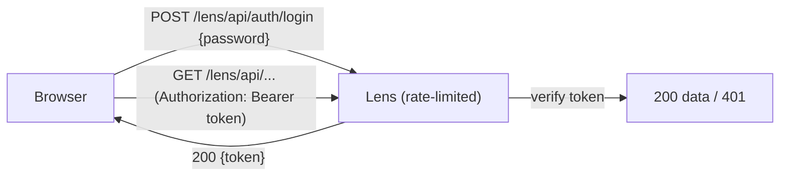

# Securing the Dashboard

<p class="lens-lead">
The Lens dashboard exposes captured requests, queries, cache operations, mail, and exceptions.
On any shared or non-local environment — staging, preview, or production — you should lock it
behind a password.
</p>

Setting `auth.password` in the adapter config turns on a built-in password lock: visitors get a
login screen, and every Lens API route requires a valid token. When `auth` is not set, the
dashboard stays open (unchanged behavior).

<Callout type="security" title="Always protect non-local environments">
Treat the dashboard and Lens API as sensitive — they surface real captured data. Enable
<code>auth</code> everywhere except local development.
</Callout>

## How it works

<Steps>
  <Step title="Login issues a token">
    The login endpoint verifies the password and returns a short-lived, stateless <strong>HMAC token</strong>.
  </Step>
  <Step title="The dashboard authenticates every call">
    The token is stored and sent as <code>Authorization: Bearer &lt;token&gt;</code> on each request; the server verifies it on every API call.
  </Step>
  <Step title="Changing the password invalidates sessions">
    The token is signed with a key derived from your password, so rotating the password revokes existing sessions.
  </Step>
</Steps>



## Configuration

Provide the password from configuration or environment — never hard-code it.

<CodeTabs :tabs="['Express', 'Fastify', 'NestJS', 'AdonisJS']">
<template #Express>

```ts
import { lens } from "@lensjs/express";

await lens({
  app,
  auth: { password: process.env.LENS_PASSWORD! },
});
```

</template>
<template #Fastify>

```ts
import { lens } from "@lensjs/fastify";

await lens({
  app,
  auth: { password: process.env.LENS_PASSWORD! },
});
```

</template>
<template #NestJS>

```ts
import { lens } from "@lensjs/nestjs";

await lens({
  app,
  adapter: "fastify", // or "express"
  auth: { password: process.env.LENS_PASSWORD! },
});
```

</template>
<template #AdonisJS>

```ts
// config/lens.ts
import { defineConfig } from "@lensjs/adonis";
import env from "#start/env";

export default defineConfig({
  // ...existing config
  auth: { password: env.get("LENS_PASSWORD") },
});
```

</template>
</CodeTabs>

## Options

| Option | Type | Default | Description |
| --- | --- | --- | --- |
| `password` | `string` | — | Required to enable the lock. |
| `secret` | `string` | password | Optional signing secret; by default the key is derived from the password. |
| `tokenTtl` | `number` | `43200` | Token lifetime in **seconds** (default 12h). |
| `maxAttempts` | `number` | `5` | Failed attempts per window before lockout. |
| `windowMs` | `number` | `60000` | Rate-limit window in milliseconds. |
| `lockoutMs` | `number` | `60000` | Base lockout in ms; doubles on each lockout, capped at 1h. |

## Hardening details

<CardGrid :cols="3">
  <Card icon="shield" title="Brute-force / DoS">
    Login is rate-limited per client IP with exponential lockout (<code>429</code> + <code>Retry-After</code>). Unauthenticated API calls are rejected by a cheap token check before any DB access.
  </Card>
  <Card icon="eye" title="Timing / enumeration">
    The password is compared in constant time, and all failures return an identical generic response — there is nothing to enumerate.
  </Card>
  <Card icon="key" title="Tokens">
    Short-lived, HMAC-signed, tamper-evident, and tied to the password.
  </Card>
</CardGrid>

<Callout type="warning" title="Use HTTPS">
Tokens (and the password on login) travel in the request. Always serve the dashboard over HTTPS
in production so they cannot be intercepted.
</Callout>

<Callout type="performance" title="Rate limiting is per-process">
The rate limiter is in-memory, so limits are tracked per Node process. If you run multiple
instances behind a load balancer, add a shared rate limit (e.g. at the proxy) for cluster-wide
protection.
</Callout>
