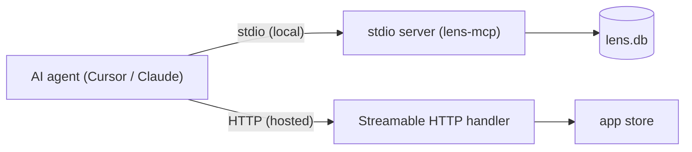

# MCP Server (AI Agents)

`@lensjs/mcp` exposes everything Lens has captured — requests, database queries, log lines, background jobs, cache operations, sent mail, outbound HTTP, and **exceptions with their stack traces and code frames** — to AI agents over the [Model Context Protocol](https://modelcontextprotocol.io). Point Cursor, Claude Desktop, or any MCP client at it and the agent can read your errors, understand the request that caused them, and propose a fix.

Everything is **read-only** and the data is already redacted at capture time — the agent can see and explain, but never modify your application or its data.



There are two ways to run it: a **standalone stdio server** for local development (the common case), and a **mountable HTTP handler** for hosted/shared setups.

## 1. Install

```bash
npm install @lensjs/mcp
```

For the stdio server you don't even need to install it — `npx` can run it on demand (see below).

## 2. Use with Cursor / Claude Desktop (stdio)

The stdio server reads your Lens SQLite database directly, so it works whether or not your app is running.

By default Lens writes to `lens.db` in your app's working directory. Point the server at that file with `--db` (or the `LENS_DB_PATH` environment variable).

### Cursor

Add the server to your `.cursor/mcp.json` (project) or `~/.cursor/mcp.json` (global):

```json
{
  "mcpServers": {
    "lens": {
      "command": "npx",
      "args": ["-y", "@lensjs/mcp", "--db", "/absolute/path/to/your/app/lens.db"]
    }
  }
}
```

### Claude Desktop

Add the same entry to `claude_desktop_config.json`:

```json
{
  "mcpServers": {
    "lens": {
      "command": "npx",
      "args": ["-y", "@lensjs/mcp", "--db", "/absolute/path/to/your/app/lens.db"]
    }
  }
}
```

Then ask your agent things like *"What's the most recent exception in Lens and how do I fix it?"* or run the `diagnose_exception` prompt.

## 3. Tools, prompts & resources

Everything maps onto the same data the dashboard shows.

### Tools

| Tool | Purpose |
| --- | --- |
| `lens_overview` | Aggregated health for a window: throughput, error rate, latency p50/p95/p99, slowest endpoints and queries, top exceptions. Start here. |
| `lens_stats` | How many entries were captured per signal type. |
| `lens_list_issues` | Exceptions grouped into issues by fingerprint, most frequent first, with counts and first/last seen. |
| `lens_list_exceptions` | Individual exceptions; filter by `fingerprint` to see one issue's occurrences. |
| `lens_get_exception` | One exception with its stack trace, code frame, and triggering request. |
| `lens_list_requests` | Requests; filter by `status` / `minStatus` / `method`, or `sortBy: "duration"` for the slowest. |
| `lens_get_request` | One request plus everything correlated to it (queries, cache, exceptions, http, mail, logs, jobs, ...). |
| `lens_list_queries` / `lens_get_query` | Database queries / one query, with `minDurationMs` and duration sorting. |
| `lens_list_slow_queries` | The slowest queries above a threshold, sorted in the database. |
| `lens_list_logs` | Application log lines; filter by `level`. |
| `lens_list_jobs` | Background jobs; filter by `status`, `queue`, or `name`. |
| `lens_list_entries` / `lens_get_entry` | Any remaining signal by type: cache, mail, outbound HTTP, events, redis, FCM. |
| `lens_search` | Substring search across every signal type (or the ones you name). |

Every list tool takes `search`, `from`, `to`, `limit`, and `cursor`. Filters, search, and time ranges are applied **in the database over the whole dataset**, so `minStatus: 500` finds every failing request, not just the failures on the first page.

### Prompts

- **`diagnose_exception`** — bundles an exception's message, stack trace, code frame, and triggering request into a ready-to-run prompt that asks for a root cause, a concrete file/line fix, and prevention.
- **`investigate_issue`** — takes an issue fingerprint and bundles its frequency, time span, and latest occurrence, asking for the cause behind *every* occurrence.
- **`debug_request`** — bundles a request's timeline (slow queries, exceptions, outbound HTTP) and asks for a diagnosis.
- **`analyze_performance`** — bundles the last 24 hours of throughput, latency percentiles, slowest endpoints and queries, and asks for concrete optimizations.

### Resources

- `lens://overview` — the current health snapshot, attachable as context.
- `lens://exception/{id}` and `lens://request/{id}` — reference a specific entry by URI.

## 4. Hosted setup (Streamable HTTP)

For shared/staging/production, mount the HTTP handler inside your running app. It uses your app's configured store (any backend), so it is not limited to SQLite.

```ts
import express from "express";
import { lens } from "@lensjs/express";
import { createLensMcpHttpHandler } from "@lensjs/mcp";

const app = express();

await lens({
  app,
  // Keep Lens from recording its own MCP endpoint.
  ignoredPaths: [/^\/lens\/mcp/],
});

app.post(
  "/lens/mcp",
  express.json(),
  createLensMcpHttpHandler({
    // Gate access — return false to reject with 401.
    authorize: (authorization) =>
      authorization === `Bearer ${process.env.LENS_MCP_TOKEN}`,
  }),
);
```

::: warning Protect the HTTP endpoint
The endpoint exposes captured data, so always require authentication, bind to a trusted network, and serve it over HTTPS. Add its path to Lens's `ignoredPaths` so Lens does not record itself.
:::

## Options

### CLI (stdio)

| Flag / env | Default | Description |
| --- | --- | --- |
| `--db <path>` / `LENS_DB_PATH` | `lens.db` | Path to the Lens SQLite database to read. |

### `createLensMcpHttpHandler(options)`

| Option | Type | Description |
| --- | --- | --- |
| `authorize` | `(authorization?: string) => boolean` | Authorize each request from its `Authorization` header. When omitted, the handler does no auth — only mount it where access is already restricted. |
| `getReader` | `() => LensReader` | Override the data source. Defaults to the running app's store via `getLensStore()`. |
| `name` / `version` | `string` | Server identity reported in the MCP handshake. |

## Security

- **Read-only.** No tool can mutate captured data or your application.
- **Already redacted.** Headers/body params are hidden and large/binary bodies are purged at capture time; the server only reads what Lens stored.
- **stdio stays clean.** The stdio server logs only to stderr, keeping the JSON-RPC channel on stdout intact.
