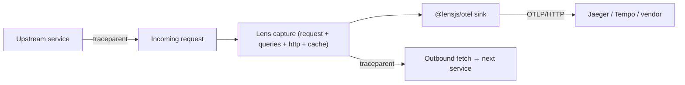

# OpenTelemetry (Tracing)

`@lensjs/otel` turns what Lens already captures into **OpenTelemetry spans** and ships them to any OTLP collector — Jaeger, Tempo, Grafana Cloud, Honeycomb, Datadog, or your own. You get distributed tracing across services without adding a second instrumentation layer to your app: Lens is already recording the request, its queries, its outbound HTTP calls, its cache operations and its exceptions, so those become a trace.

Lens keeps its dashboard for deep, single-request debugging; OTel gives you the cross-service view. You can run both.



## 1. Install

```bash
npm install @lensjs/otel
```

There is no OpenTelemetry SDK to install — the package speaks OTLP/HTTP JSON directly and has no dependencies beyond Lens itself.

## 2. Enable it

Call `createLensOtel()` once at startup, alongside your `lens()` setup. Registering the exporter is what enables tracing; with no exporter registered Lens does no trace work at all.

```ts
import { lens } from "@lensjs/express";
import { createLensOtel } from "@lensjs/otel";

await lens({ app });

createLensOtel({
  endpoint: "http://localhost:4318", // OTLP/HTTP collector
  serviceName: "checkout-api",
});
```

Both options fall back to the standard OpenTelemetry environment variables, so in most deployments you can call `createLensOtel()` with no arguments at all:

| Option | Environment variable | Default |
| --- | --- | --- |
| `endpoint` | `OTEL_EXPORTER_OTLP_ENDPOINT` | `http://localhost:4318` |
| `serviceName` | `OTEL_SERVICE_NAME` | `lens` |

`/v1/traces` is appended to the endpoint when it isn't already there. Pass `headers` for vendor authentication:

```ts
createLensOtel({
  endpoint: "https://api.honeycomb.io",
  serviceName: "checkout-api",
  headers: { "x-honeycomb-team": process.env.HONEYCOMB_API_KEY! },
});
```

Call `shutdown()` to stop exporting (useful in tests):

```ts
const otel = createLensOtel();
otel.shutdown();
```

## 3. What the spans look like

Each captured request becomes one trace:

- A root **SERVER** span named `GET /users`, carrying `http.request.method`, `url.path` and `http.response.status_code`. A 5xx marks the span as errored.
- A child span per correlated entry, all parented to the root:

| Lens signal | Span | Kind | Key attributes |
| --- | --- | --- | --- |
| Query | `db.query` | CLIENT | `db.query.text`, `db.system` |
| Outbound HTTP | `HTTP POST` | CLIENT | `url.full`, `http.response.status_code` |
| Cache | `cache get` | CLIENT | `cache.key` |
| Redis | `redis GET` | CLIENT | `db.system`, `db.operation` |
| Exception | `exception TypeError` | INTERNAL | `exception.type`, `exception.message` |

Timings come from each entry's captured start time and duration, so the span waterfall matches what the Lens dashboard shows. Attribute values are truncated at 512 characters, and the payloads are the same **already-redacted** ones Lens persists — no secret reaches your collector that wasn't already safe to store.

## 4. Distributed tracing

Trace context follows the [W3C Trace Context](https://www.w3.org/TR/trace-context/) standard, in both directions:

- **Inbound** — when a request arrives with a `traceparent` header, Lens joins that trace instead of starting a new one, and the root span is parented to the caller's span. Your service shows up in the caller's waterfall.
- **Outbound** — with [`instrumentFetch()`](/handlers/http) installed, every `fetch` made during a request carries a `traceparent` pointing at that request's root span, so the next service continues the same trace.

```ts
import { instrumentFetch } from "@lensjs/watchers";

instrumentFetch();
```

Supported on the Express, Hono, and Next.js adapters.

## 5. Try it locally

Run a collector with an all-in-one Jaeger container:

```bash
docker run --rm -p 16686:16686 -p 4318:4318 jaegertracing/all-in-one:latest
```

Then start your app with the endpoint set and open the Jaeger UI at `http://localhost:16686`:

```bash
OTEL_EXPORTER_OTLP_ENDPOINT=http://localhost:4318 npm run dev
```

The `apps/express` example in the repository is wired this way — set `LENS_OTEL_ENDPOINT` and hit `/all-watchers` to see a request with database, cache, HTTP, Redis and exception spans in one trace.

## Notes

- Export is **fire-and-forget**: it happens after the response has been sent and never blocks or throws into your app. If the collector is unreachable, Lens logs the failure and keeps serving traffic.
- Traces are exported for the requests Lens captures. If you enable [sampling](/adapters/express/configuration#sampling), a request that is sampled out produces no span.
