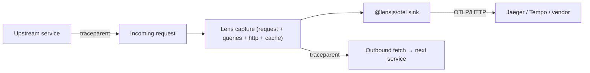

# OpenTelemetry (Tracing)

<p class="lens-lead">
<code>@lensjs/otel</code> turns what Lens already captures into <strong>OpenTelemetry spans</strong>
and ships them to any OTLP collector — Jaeger, Tempo, Grafana Cloud, Honeycomb, Datadog, or your
own. You get distributed tracing without adding a second instrumentation layer.
</p>

Lens is already recording each request, its queries, its outbound HTTP calls, its cache operations
and its exceptions — so those become a trace. Keep the dashboard for deep, single-request
debugging; use OTel for the cross-service view. You can run both.



## Setup

<Steps>
<Step title="Install the package">

<CommandCopy pkg="@lensjs/otel" />

<Callout type="info" title="No SDK required">
There is no OpenTelemetry SDK to install — the package speaks OTLP/HTTP JSON directly and has no
dependencies beyond Lens itself.
</Callout>

</Step>
<Step title="Enable it">

Call `createLensOtel()` once at startup, alongside your `lens()` setup. Registering the exporter is
what enables tracing; with no exporter registered, Lens does no trace work at all.

```ts
import { lens } from "@lensjs/express";
import { createLensOtel } from "@lensjs/otel";

await lens({ app });

createLensOtel({
  endpoint: "http://localhost:4318", // OTLP/HTTP collector
  serviceName: "checkout-api",
});
```

</Step>
</Steps>

Both options fall back to the standard OpenTelemetry environment variables, so in most deployments
you can call `createLensOtel()` with no arguments at all:

| Option | Environment variable | Default |
| --- | --- | --- |
| `endpoint` | `OTEL_EXPORTER_OTLP_ENDPOINT` | `http://localhost:4318` |
| `serviceName` | `OTEL_SERVICE_NAME` | `lens` |

`/v1/traces` is appended to the endpoint when it isn't already there. Pass `headers` for vendor
authentication:

```ts
createLensOtel({
  endpoint: "https://api.honeycomb.io",
  serviceName: "checkout-api",
  headers: { "x-honeycomb-team": process.env.HONEYCOMB_API_KEY! },
});
```

Call `shutdown()` to stop exporting (useful in tests):

```ts
const otel = createLensOtel();
otel.shutdown();
```

## What the spans look like

Each captured request becomes one trace: a root **SERVER** span named `GET /users` carrying
`http.request.method`, `url.path` and `http.response.status_code` (a 5xx marks the span as
errored), with a child span per correlated entry:

| Lens signal | Span | Kind | Key attributes |
| --- | --- | --- | --- |
| Query | `db.query` | CLIENT | `db.query.text`, `db.system` |
| Outbound HTTP | `HTTP POST` | CLIENT | `url.full`, `http.response.status_code` |
| Cache | `cache get` | CLIENT | `cache.key` |
| Redis | `redis GET` | CLIENT | `db.system`, `db.operation` |
| Exception | `exception TypeError` | INTERNAL | `exception.type`, `exception.message` |

<Callout type="security" title="Only redacted payloads leave your app">
Timings come from each entry's captured start time and duration, so the span waterfall matches the
Lens dashboard. Attribute values are truncated at 512 characters, and payloads are the same
<strong>already-redacted</strong> ones Lens persists — no secret reaches your collector that wasn't
already safe to store.
</Callout>

## Distributed tracing

Trace context follows the [W3C Trace Context](https://www.w3.org/TR/trace-context/) standard, in
both directions:

<CardGrid :cols="2">
  <Card icon="arrow-right" title="Inbound">
    When a request arrives with a <code>traceparent</code> header, Lens joins that trace instead of starting a new one, so your service shows up in the caller's waterfall.
  </Card>
  <Card icon="network" title="Outbound">
    With <code>instrumentFetch()</code> installed, every <code>fetch</code> during a request carries a <code>traceparent</code> pointing at that request's root span, continuing the trace downstream.
  </Card>
</CardGrid>

```ts
import { instrumentFetch } from "@lensjs/watchers";

instrumentFetch();
```

Supported on the Express, Hono, and Next.js adapters.

## Try it locally

<Steps>
<Step title="Run a collector">

Start an all-in-one Jaeger container:

```bash
docker run --rm -p 16686:16686 -p 4318:4318 jaegertracing/all-in-one:latest
```

</Step>
<Step title="Start your app with the endpoint set">

```bash
OTEL_EXPORTER_OTLP_ENDPOINT=http://localhost:4318 npm run dev
```

Then open the Jaeger UI at `http://localhost:16686`.

</Step>
</Steps>

The `apps/express` example in the repository is wired this way — set `LENS_OTEL_ENDPOINT` and hit
`/all-watchers` to see a request with database, cache, HTTP, Redis and exception spans in one
trace.

<Callout type="performance" title="Non-blocking by design">
Export is <strong>fire-and-forget</strong>: it happens after the response is sent and never blocks
or throws into your app. If the collector is unreachable, Lens logs the failure and keeps serving
traffic. Traces are exported for the requests Lens captures — if you enable
<a href="/adapters/express/configuration#sampling">sampling</a>, a request that is sampled out
produces no span.
</Callout>
